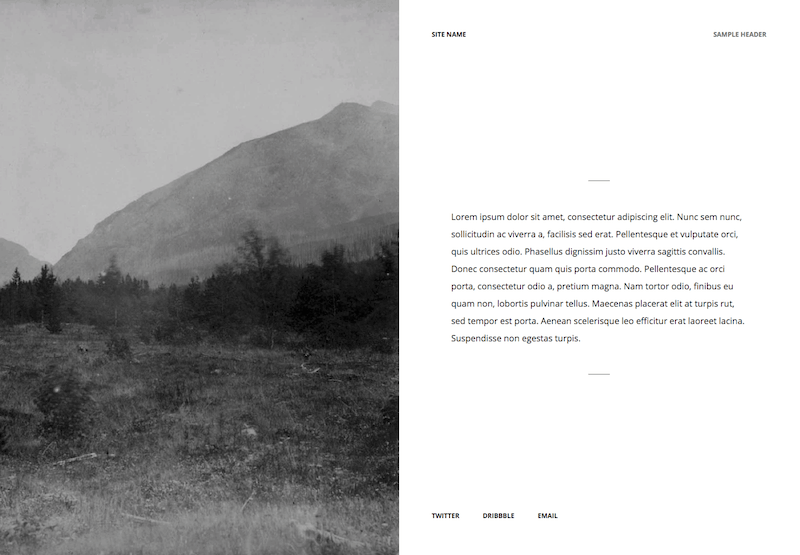

# Sapling
This is a custom theme for Siteleaf. Currently this theme only accounts for a single page with limited content -- meant to serve as a landing page for your home on the internet.

## This is what it looks like


### Live Preview
[See](http://carlaweishale.com/) it in action. 🔥

## How to use it
### Siteleaf

First step: Fork the repository. Then, connect your Siteleaf site to the forked repo within Siteleaf's settings via `Settings > Sync > Repo`.

#### Settings

**Site Title** will be used in the top left of the page.

Under **Social**, add new social accounts and URLs. They will appear in the footer of the site.

The **Site Description** setting is used for SEO. Add a short description of your site here.

**Fonts**: Here you can link to Typekit, Typography.com, and Google Fonts.

Example: 
```html
<link rel="stylesheet" type="text/css" href="https://cloud.typography.com/1234567/1234567/css/fonts.css" />
```

**Font Style**: This area is a place for you to add custom CSS for your fonts.

Example:
```sass
.footer,
.header p {
  font-family: "Gotham SSm A","Gotham SSm B";
  font-weight: 700;
  font-style: normal;
}
```

### And Then...
1. Create a page and make sure _Default Layout_ is selected in **Advanced Options**. This will be your home page.
2. Give it a title.
3. 🎉**TADA!**

#### Layout Notes:

  - The `content` of the page is what shows up in between the tiny lines in the middle of the page
  - The `header` field shows in the top right of the page
  - The `image` field holds the main site image. (It should be big in resolution but not file size. The placeholder is 1440 × 2000 pixels and 106kb.). We recommend [TinyPNG](https://tinypng.com/) for image crunching.

---

### Jekyll (Standalone HTML)

[Jekyll](http://jekyllrb.com/) requires Ruby to run.

Install dependencies with `bundle install`. `gem install bundler` may be necessary if `bundle` doesn't run for you.

### Development

Run `bundle exec jekyll serve` to compile and serve the site at [localhost:4000](http://localhost:4000).

If you only want to compile, run `bundle exec jekyll build` which will compile the static site into the `_site` folder. You can take the contents of this folder and upload it/deploy it to a web server. It's just static HTML!

### Sass Notes
To keep this project super simple, we are not including any task runners (this may change in the future). So, Jekyll handles the Sass compilation on its own.
